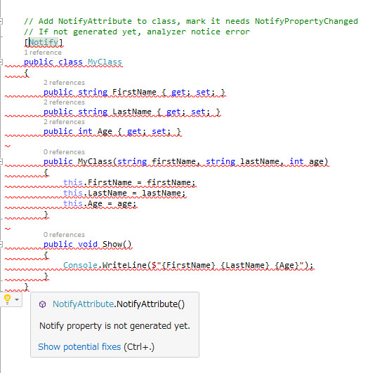
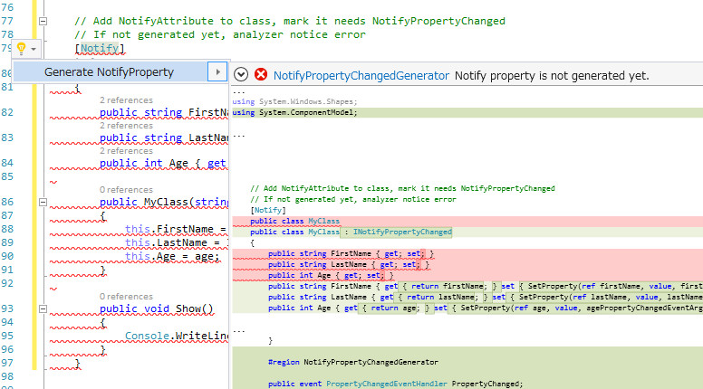
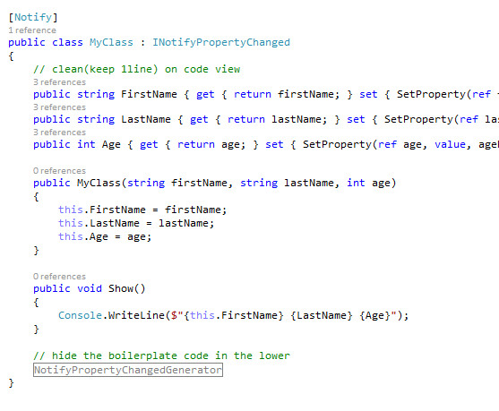

# NotifyPropertyChangedGenerator
Roslyn Analyzer/Generator for avoid boring boilerplate INotifyPropertyChanged implementation.

Installation
---
You can donwload from NuGet, [NotifyPropertyChangedGenerator](http://www.nuget.org/packages/NotifyPropertyChangedGenerator).

* PM> Install-Package NotifyPropertyChangedGenerator

Supports platforms are all and all .NET Framework(3.5 supports!) but requires Visual Studio 2015.

What is this?
---
* Super lightweight to write INotifyPropertyChanged
* Keeping code clean in view
* Being strong in a change
* POMO(Plain Old MVVM Object), you don't need inherit base class

Static analyzed. `NotifyAttribute` to class or `NotifyAttribute` to property, Roslyn Analyzer checks are all target properties implemented(generated) Notify property. If not, output compiler error.

If set `NotifyAttribute` to class, target properties are all property. You can ignore set `NonNotifyAttribute` to nontarget property. If set `NotifyAttribute` only to property, its target property is opt-in.

Press `Ctrl+.`(Lightbulb QuickFix), preview the change.

The modified class is clean, noisy boilerplate codes are lower in the code, not around a property.

What is different with Code Snippet?
---
Code snippet is easy to write but difficult to read. Generated code is very noisy because code snippet does not support that generate to separating.

What is different with PostSharp or Fody?
---
There are easy to write and easy to read but difficult to build and debug. NotifyPropertyChangedGenerator is only simple compile time analyze/generator and fully Visual Studio integrated. 